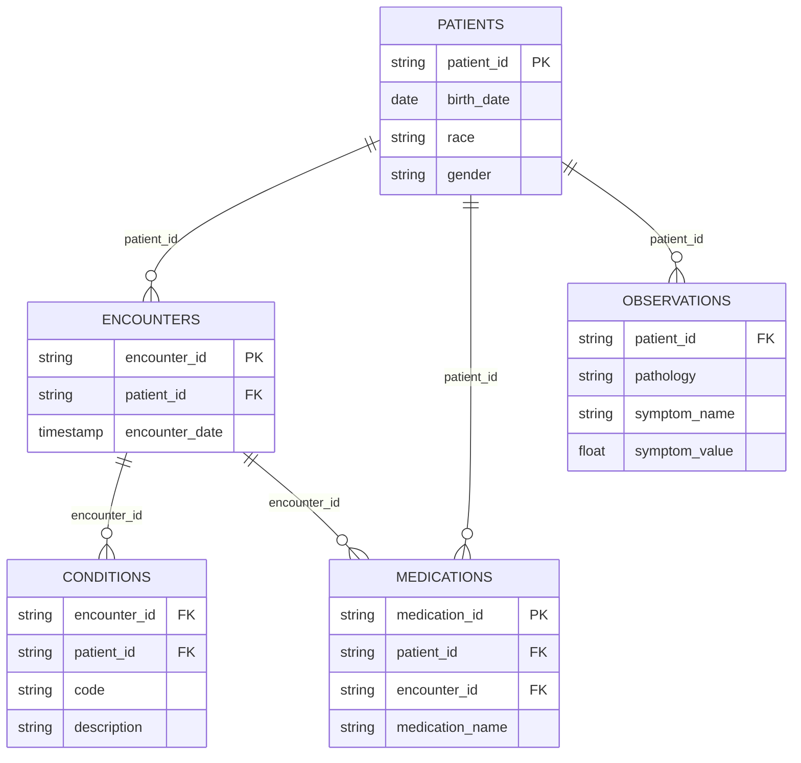

# Century Health Data Pipeline

This project ingests simulated clinical data, standardizes the source tables, unpacks symptom observations, and publishes analysis-ready CSV files. The pipeline is implemented with pandas and is organized into three stages:

1. **Staging**: ingest CSV, Parquet, and Excel files; standardize names, types, categories, dates, and duplicate records.
2. **Transform**: aggregate conditions, medications, and observations into a master table at one row per encounter.
3. **Load final**: copy the staged tables and master table into `outputs/`.

## Repository layout

```text
Data/                   # Landed source files
staging/                # Intermediate cleaned tables
outputs/                # Published CSV tables
src/century_health/     # Pipeline implementation
tests/                  # EDA, ERD, dbt design, debugging, and SQL work
run_pipeline.py         # Pipeline entry point
```

## Q&A files

All assignment questions, analysis, and written answers are collected in the [`tests/`](tests/) folder:

- [EDA notebook](tests/1.%20century_health_eda.ipynb)
- [Entity relationship diagram](tests/2.%20erd.md)
- [dbt project design](tests/3.%20dbt_project_design.md)
- [Pipeline debugging notebook](tests/4.%20Debug%20This%20Pipeline.ipynb)
- [SQL questions notebook](tests/5.%20sql%20questions.ipynb)

## How to run the pipeline

The project uses `uv` for dependency management. From the repository root:

```powershell
uv sync
uv run python run_pipeline.py
```

The default directories are `Data/`, `staging/`, and `outputs/`. They can be overridden:

```powershell
uv run python run_pipeline.py `
	--data-dir Data `
	--staging-dir staging `
	--final-dir outputs
```

Each stage allows one extra attempt by default. To retry from a failed stage:

```powershell
uv run python run_pipeline.py --retry-stage transform --retries 2
```

The command writes `patients.csv`, `encounters.csv`, `medications.csv`, `observations.csv`, `conditions.csv`, and `master.csv` to both the staging and final output locations. The master table has one row per encounter; one-to-many conditions, medications, and symptoms are aggregated before joining.

## EDA summary: issues and recommendations

| Table | Area | Main issue | Recommendation |
| --- | --- | --- | --- |
| `patients` | Missingness | `GENDER` and `DEATHDATE` are completely null. | Preserve the columns as nullable fields for future data, or drop them only from marts where they are not needed. |
| `patients` | Privacy | SSN, passport, and driver's license are direct identifiers. | Restrict access and remove unnecessary identifiers from analytical marts. |
| `patients` | Schema | Categorical fields may contain inconsistent values or casing. | Normalize and validate categorical values during staging. |
| `encounters` | Schema | Source names are inconsistent (`Id`, `PATIENT`). | Rename them to `encounter_id` and `patient_id`. |
| `encounters` | Dates | `START` and `STOP` are strings and may include UTC markers. | Parse them as timezone-aware datetimes, coercing invalid values to null. |
| `symptoms` | Structure | `GENDER`, `RACE`, and `ETHNICITY` repeat patient attributes. | Treat the patient table as the authoritative source and avoid duplicating these fields downstream. |
| `symptoms` | Missingness | `GENDER` and `AGE_END` are completely null. | Preserve nullable source fields and flag missingness for downstream consumers. |
| `symptoms` | Validation | `NUM_SYMPTOMS` may not match parseable symptom pairs. | Recalculate the count from successfully parsed symptom pairs. |
| `medications` | Schema | Column names are inconsistent and there is no explicit medication key. | Standardize names and create a deterministic key from patient, encounter, code, and start timestamp. |
| `medications` | Dates | Medication timestamps are stored as strings. | Parse `start` and `stop` as timezone-aware datetimes. |
| `medications` | Validation | Costs require numeric validation and may contain negative values. | Cast costs to numeric, investigate negative values, and define an approved outlier policy. |
| `conditions` | Schema and missingness | `START` and `STOP` need date parsing, and `STOP` is entirely null. | Parse dates as nullable values and document that no end date is currently available. |
| `conditions` | Formatting | `CODE` and `DESCRIPTION` have inconsistent case. | Preserve diagnosis codes in a canonical format and normalize description casing consistently. |

The implemented staging code applies the relevant standardization, date and numeric casts, duplicate removal, symptom parsing, and deterministic medication key described above. Privacy removal and negative-cost investigation remain governance and data-quality follow-ups rather than silent data changes.

## Entity relationship diagram



## Proposed dbt transformation

The dbt version is a written design exercise; dbt is not required to run this pandas project. A maintainable dbt project would be structured as follows:

```text
dbt_century_health/
	dbt_project.yml
	models/
		staging/
			stg_patients.sql
			stg_encounters.sql
			stg_conditions.sql
			stg_medications.sql
			stg_symptoms.sql
			_staging.yml
		intermediate/
			int_symptom_observations.sql
			int_encounter_conditions.sql
			int_patient_medications.sql
			_intermediate.yml
		marts/
			fct_patient_encounters.sql
			dim_patients.sql
			_marts.yml
	seeds/
	tests/
	snapshots/
```

Sources declare the five landed datasets. Staging models rename columns, cast dates and numerics, and normalize categories. Intermediate models unpack symptoms and aggregate one-to-many conditions and medications. The marts layer publishes `dim_patients` and `fct_patient_encounters`.

### Model descriptions

- `int_symptom_observations` unpacks the packed symptom string into one row per patient, pathology, and symptom name. It depends on `stg_symptoms`.
- `int_encounter_conditions` groups condition records by encounter and collects diagnosis codes and descriptions. Its grain is one row per encounter and it depends on `stg_conditions`.
- `fct_patient_encounters` joins cleaned encounters to patient attributes and pre-aggregated conditions, medications, and symptoms. Its grain is one row per encounter and it depends on the staging and intermediate models.

### Proposed dbt tests

- `stg_patients.patient_id`: `not_null` and `unique` to protect the patient dimension key.
- `stg_encounters.encounter_id`: `not_null` and `unique` to prevent duplicate visit facts.
- `fct_patient_encounters.patient_id`: `not_null` to ensure each fact has a subject key.
- `int_symptom_observations.symptom_value`: accepted range from 0 to 100.
- `stg_medications.end_date`: custom test allowing null or a date on or after `start_date`.
- `fct_patient_encounters.encounter_date`: `not_null` to prevent undated facts entering time-series analysis.

## Running SQL against pandas DataFrames

For local SQL exploration, DuckDB can query pandas DataFrames directly. Install it in the project environment if needed:

```powershell
uv add duckdb
```

Then register the DataFrames and execute SQL:

```python
import duckdb
import pandas as pd

patients = pd.read_csv("outputs/patients.csv")
encounters = pd.read_csv("outputs/encounters.csv")

query = """
SELECT patient_id, COUNT(*) AS encounter_count
FROM encounters
GROUP BY patient_id
ORDER BY encounter_count DESC
"""

result = duckdb.sql(query).df()
print(result)
```

DuckDB resolves the DataFrame variable names as queryable relations. The SQL answers and exploratory work are also captured in `tests/5. sql questions.ipynb`.

## AI use

AI was used for:

1. Creating and organizing this README from the project requirements and existing implementation.
2. Drafting Markdown documentation for the EDA findings and proposed dbt project design.
3. Listing and explaining how to run SQL queries against pandas DataFrames locally.
4. Restructuring and documenting the project files.