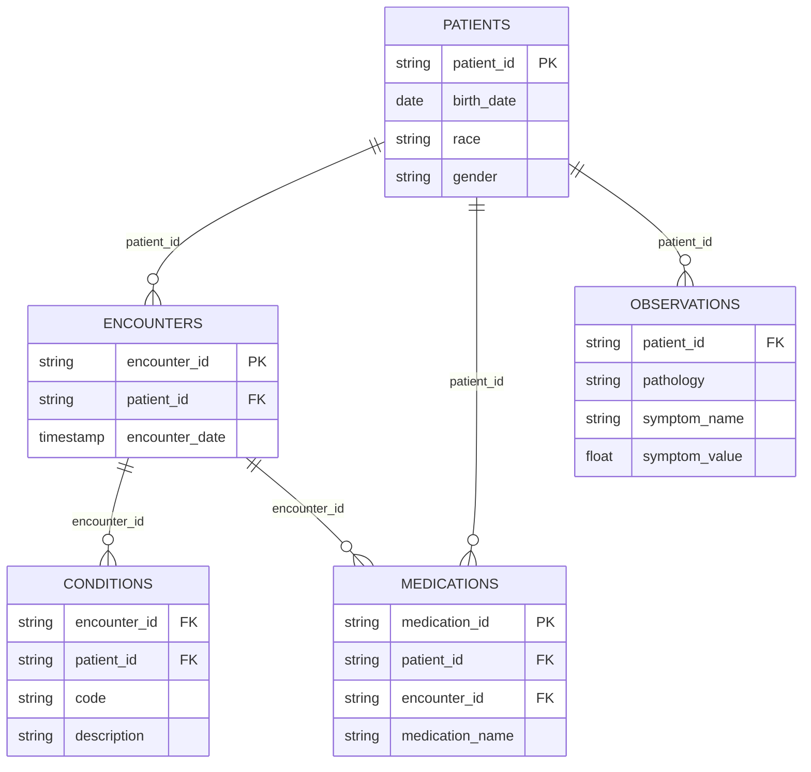

# Entity Relationship Diagram

```mermaid
erDiagram
    PATIENTS ||--o{ ENCOUNTERS : "patient_id"
    PATIENTS ||--o{ MEDICATIONS : "patient_id"
    PATIENTS ||--o{ OBSERVATIONS : "patient_id"
    ENCOUNTERS ||--o{ CONDITIONS : "encounter_id"
    ENCOUNTERS ||--o{ MEDICATIONS : "encounter_id"
    PATIENTS {
        string patient_id PK
        date birth_date
        string race
        string gender
    }
    ENCOUNTERS {
        string encounter_id PK
        string patient_id FK
        timestamp encounter_date
    }
    CONDITIONS {
        string encounter_id FK
        string patient_id FK
        string code
        string description
    }
    MEDICATIONS {
        string medication_id PK
        string patient_id FK
        string encounter_id FK
        string medication_name
    }
    OBSERVATIONS {
        string patient_id FK
        string pathology
        string symptom_name
        float symptom_value
    }
```